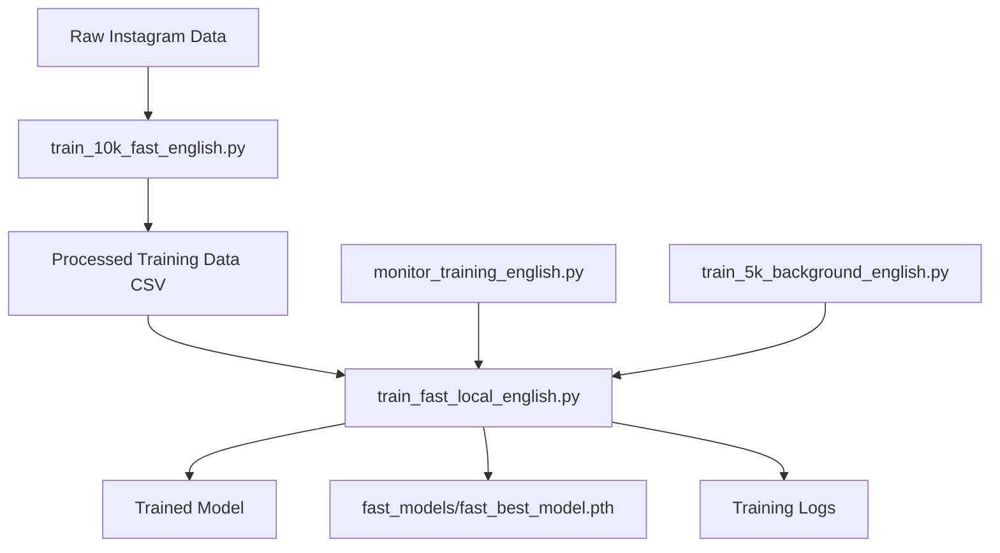

# Model Training Programs - English Version

This document describes the most important Python programs for the model training stage, translated to English.

## 🎯 Core Training Programs

### 1. **train_fast_local_english.py** - Core Training Module
- **Purpose**: Main lightweight multimodal model training
- **Features**:
  - Fast training (1-2 hours completion)
  - Lightweight gender bias model (ResNet18 + DistilBERT)
  - Multiple training modes (ultra-fast/fast/standard)
  - Automatic device detection (CPU/GPU)
  - Progress saving and resumption
  - Early stopping and learning rate scheduling

**Key Classes**:
- `FastInstagramDataset`: Instagram dataset for fast training
- `LightweightGenderBiasModel`: Optimized multimodal model
- `FastTrainer`: Main training orchestrator

**Usage**:
```bash
python3 train_fast_local_english.py
# Choose mode: 1 (2K samples), 2 (5K samples), 3 (all samples)
```

### 2. **train_5k_background_english.py** - Background Training Script
- **Purpose**: Run 5K sample training in background
- **Features**:
  - Fixed 5K sample configuration
  - Background-optimized logging
  - Calls the core training module

**Usage**:
```bash
nohup python3 train_5k_background_english.py > training.log 2>&1 &
```

### 3. **train_10k_fast_english.py** - Training Data Processor
- **Purpose**: Process raw Instagram data for training
- **Features**:
  - Concurrent API calls for speed
  - Gender bias scoring (0-10 scale)
  - Batch processing with progress saving
  - Error handling and statistics

**Key Features**:
- Processes 10K Instagram posts
- Concurrent processing (8 simultaneous requests)
- Base64 image encoding
- OpenRouter API integration

**Usage**:
```bash
python3 train_10k_fast_english.py
```

### 4. **monitor_training_english.py** - Training Monitor
- **Purpose**: Monitor training process status and progress
- **Features**:
  - Real-time process monitoring
  - Resource usage tracking (CPU, memory)
  - Training progress parsing
  - Continuous monitoring mode

**Usage**:
```bash
# Single status check
python3 monitor_training_english.py

# Continuous monitoring
python3 monitor_training_english.py watch
```

## 🔄 Training Workflow



## 📊 Training Modes

| Mode | Samples | Time | Purpose |
|------|---------|------|---------|
| Ultra-fast | 2,000 | ~30 min | Quick testing |
| Fast | 5,000 | ~60 min | Standard training |
| Standard | All | ~90 min | Full dataset |

## 🎯 Model Architecture

- **Image Encoder**: ResNet18 (pretrained)
- **Text Encoder**: DistilBERT-base-uncased
- **Fusion**: Linear layers with dropout
- **Output**: Sigmoid activation (0-1 range)
- **Loss**: MSE Loss
- **Optimizer**: AdamW with weight decay

## 📁 Output Files

- `fast_best_model.pth`: Best model checkpoint
- `fast_latest_model.pth`: Latest model checkpoint
- `fast_training.log`: Training logs
- `train_10k_fast_results.csv`: Processed training data

## 🚀 Quick Start

1. **Process training data**:
```bash
python3 train_10k_fast_english.py
```

2. **Start training**:
```bash
python3 train_fast_local_english.py
```

3. **Monitor progress**:
```bash
python3 monitor_training_english.py watch
```

4. **Background training**:
```bash
nohup python3 train_5k_background_english.py > training.log 2>&1 &
```

## 🔧 Configuration

Key parameters in `FastTrainer`:
- `batch_size`: 32 (optimized for speed)
- `learning_rate`: 5e-4 (aggressive for fast convergence)
- `num_epochs`: 6 (with early stopping)
- `max_samples`: Configurable (2K/5K/all)

## 📈 Performance Optimization

- Frozen early transformer layers
- Reduced hidden dimensions
- Aggressive learning rate scheduling
- Early stopping (patience=2)
- No multiprocessing overhead
- Simplified image preprocessing

